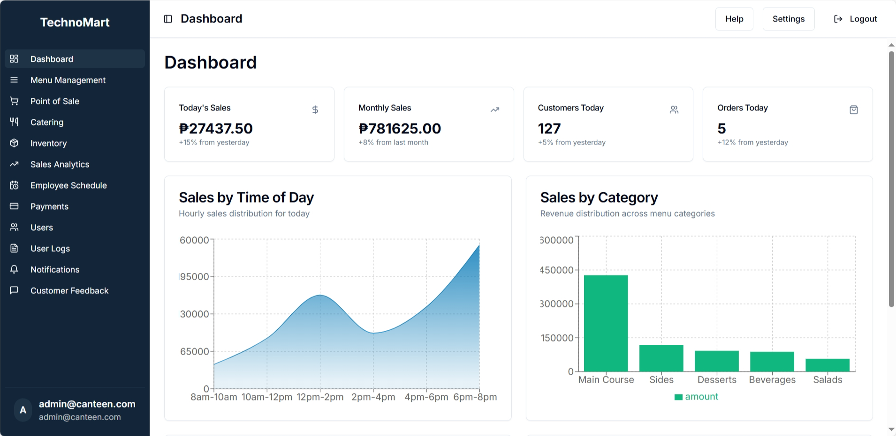

# Welcome

# 🍽️ Technomart Canteen Management System

An intelligent canteen ordering system built for the CTU-MC Multipurpose Cooperative. This platform digitizes food ordering, payment processing, inventory tracking, and user analytics — optimized for speed, accessibility, and usability across devices.

---

## 🧰 Tech Stack

- ⚡ **Vite** — Lightning-fast development server and bundler
- ⚛️ **React** — Component-based UI framework
- ✨ **TypeScript** — Type-safe JavaScript for scalability
- 🎨 **Tailwind CSS** — Utility-first CSS framework
- 🧩 **shadcn/ui** — Accessible, headless UI components

---

## 📸 Screenshots



---

## 🚀 Features

- ✅ Mobile-first design for ordering meals
- 💳 Supports cash, GCash, and other digital payments
- 📦 Inventory and supplier management
- 📈 Analytics dashboard for admins
- 🔐 Role-based access (Admin, Staff, Customer)
- 🛎️ Pre-ordering, order tracking, and real-time status updates

---

## 🛠️ Installation

```bash
# Clone the repo
git clone https://github.com/jsephandrade/technomart-canteen-management-system.git
cd technomart-canteen-management-system

# Install dependencies
npm install

# Run development server
npm run dev
```

---

## 🔧 Environment & Backend Integration

- Copy `.env.example` to `.env` and set values for your environment.
  - `VITE_API_BASE_URL` → keep `/api` in development to use the Vite proxy.
  - `VITE_DEV_PROXY_TARGET` → your backend URL in dev, e.g. `http://localhost:8000`.
  - `VITE_WS_URL` (optional) → WebSocket endpoint if using real-time features.
- Dev proxy: Vite is configured to forward `/api` requests to `VITE_DEV_PROXY_TARGET` to avoid CORS.
- Production: Set `VITE_API_BASE_URL` to your public API origin (e.g. `https://api.example.com`).
- The API client reads `VITE_API_BASE_URL` and falls back to `/api` if not set.

### 📐 Data Contracts with Zod
- Schemas live in `src/api/schemas/*` (User, Role, MenuItem, InventoryItem, Order, Payment, Feedback, Catering, Dashboard).
- Use `validate(schema, data)` to assert API responses/requests.
- DTO mappers live in `src/api/mappers/*` (e.g., `userApiToModel`, `userModelToCreatePayload`).
- Services should validate and normalize fields (e.g., role/status casing) before returning to UI.

### 🔒 Security & Compliance
- CSRF: If your backend uses cookie-based auth, enable credentials and set CSRF names in `.env`.
  - `VITE_SEND_CREDENTIALS=true`
  - `VITE_CSRF_COOKIE_NAME=csrftoken` and `VITE_CSRF_HEADER_NAME=X-CSRFToken` (or your backend values)
  - The API client auto-adds the CSRF header for unsafe methods (POST/PUT/PATCH/DELETE).
- CORS: In dev, requests go through Vite proxy (`/api` → `VITE_DEV_PROXY_TARGET`) to avoid CORS. In prod, ensure backend CORS allows your frontend origin and credentials if you use cookies.
- Input sanitization: This UI renders user-supplied text as plain text (React escapes it). Avoid injecting HTML; if needed, sanitize on the server.
- PII safety: The app avoids logging tokens or user PII. Do not add console logs that include auth tokens, emails, or personal data.
